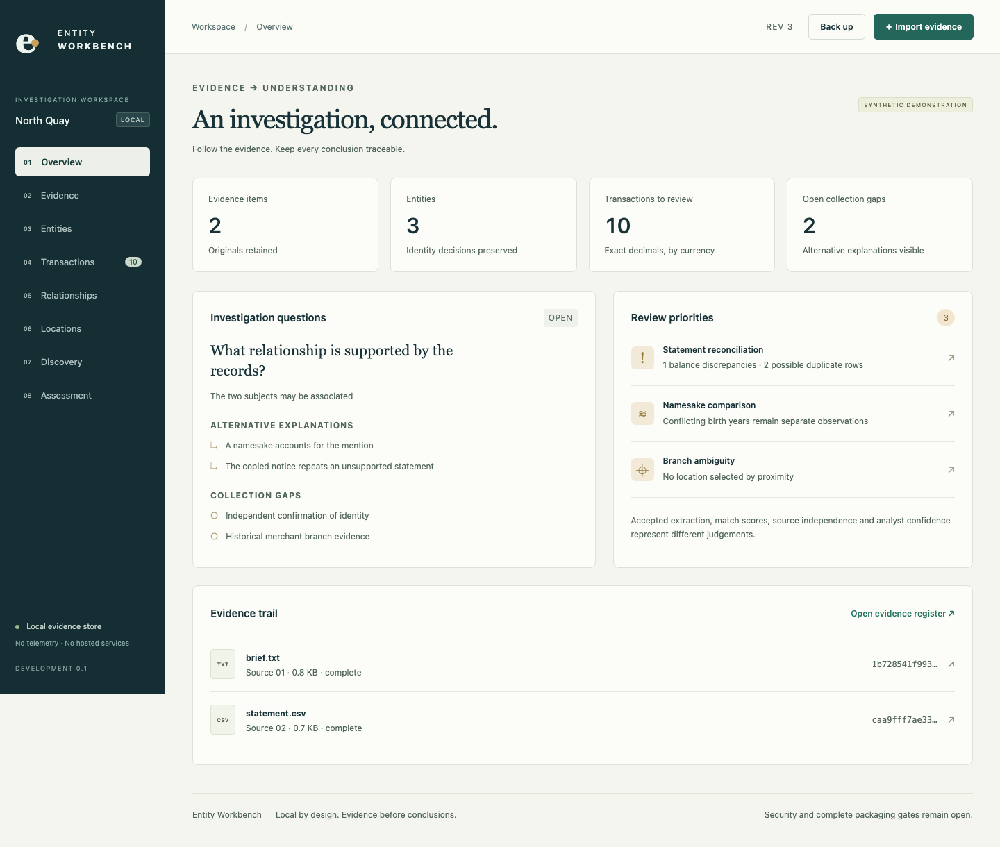

# Entity Workbench

An independently branded desktop investigation workbench. Preserve sources, review observations, distinguish identities and produce cited findings with an inspectable history.

**Status: active development, not an approved investigative release.** The current macOS development application supports local text/CSV evidence, transaction review, general entity/observation authoring, reviewed identity comparison and merge/reversal, graph and coordinate views, direct website collection, local Lucene search and HTML assessment snapshots. The complete release gates have **not** passed. See [implementation status](docs/STATUS.md) and the [security review entry point](SECURITY.md).

No hosted search service, account, API key or generative model is used. The application collects analyst-selected public websites directly and searches its own local index. Coverage consists of collected and imported sources. It does not claim a global web index or comprehensive open-web results.



## Run the development application

Development prerequisites are different from end-user requirements. Building from source currently requires Rust, Node/npm and native platform build tools. Building specialist engines additionally requires a JDK and Python. An approved end-user distribution must bundle all required runtimes; that distribution is still in development.

```sh
npm ci
cargo test -p workbench-core
cargo build -p workbench-core --bin ew-dev
npm run build
npm run desktop
```

For the browser-based synthetic UI harness, run `npm run dev` and open `http://127.0.0.1:1420`. This development-only loopback bridge executes the real Rust core against `artifacts/synthetic-ui-workspace`. It refuses direct web collection and cross-origin requests. It is not included in production UI assets or the desktop runtime.

For the macOS development bundle with app-local Java and Lucene:

```sh
python3 scripts/bootstrap_maven.py
artifacts/tools/apache-maven-3.9.11/bin/mvn -f workers/java/pom.xml package
python3 scripts/bootstrap_java.py
python3 scripts/test_java_workers.py
python3 scripts/test_macos_confinement.py
python3 scripts/stage_macos_engines.py
cd desktop
../node_modules/.bin/tauri build --bundles app
```

These bootstrap scripts run only on the developer's machine. They are not first-run dependency installers. The current macOS prototype uses a restricted Seatbelt profile with Apple's private `dyld-support.sb` bootstrap rules. Signed helper validation and the supported OS matrix remain release requirements.

## Start an investigation

1. Load the fictional North Quay investigation in an empty workspace.
2. Open Transactions and inspect the café debit against its source row. Correct `-180.00` to `-18.00` with a reason, then accept the corrected row.
3. Review both transfer rows and explicitly match the counterpart transactions. Matching is never inferred solely from equal amounts.
4. Create or edit entities in Entities, preserving reference namespaces and leading zeros. Add observations anchored to retained text lines or CSV cells, inspect the exact excerpt and review each observation. Compare any two records; keep them separate, defer the decision or record a reversible merge. Comparison signals use accepted exact values and do not represent identity probabilities.
5. In Discovery, preview selected HTTPS seed URLs, then collect their public pages. Only selected hosts are in scope. Robots requests and redirects count against the request limit.
6. Search the imported/collected corpus in Evidence. The macOS bundle supports Boolean, phrase, proximity, fuzzy and fielded Lucene queries.
7. Save an assessment snapshot. Subsequent corrections flag current findings without changing previous exports.

All repository fixtures, screenshots and automated workflow tests are synthetic. Live network smoke tests use harmless public documentation pages and are excluded from CI.

## Transaction CSV profile

The development profile accepts UTF-8 CSV with these headers:

```csv
account,date,posting_date,description,amount,currency,balance
DEMO-001,2025-03-01,2025-03-02,Fictional purchase,-12.30,AUD,87.70
```

Required: `account`, `date`, `description`, `amount`, `currency`. Optional: `posting_date`, `balance`. Dates use `YYYY-MM-DD`. Amounts are exact decimal strings; negative means debit and positive means credit. Currency is a three-letter uppercase code. No currency conversion occurs. Original row descriptions and source anchors are retained. Other statement layouts need the mapping-profile workflow, which is not implemented yet.

## Architecture and review

- React/TypeScript and Tauri provide the desktop interface.
- Rust owns the SQLite workspace, evidence store, validation, decisions, calculations and HTTP broker.
- Java document parsing and Java Lucene search have separate entry points and process roles. Document parsing is not enabled in the application while its full isolation gate remains open.
- Python adapters demonstrate DuckDB/Parquet totals, NetworkX paths and spaCy phrase candidates. Splink remains blocked until a calibrated model is supplied; no untrained probability is presented as an identity decision.
- Cytoscape, ECharts and MapLibre present relationships, totals and local coordinates. There are no external map tiles.

Read [architecture](docs/ARCHITECTURE.md), [versioned schemas](schemas/), [verification](docs/VERIFICATION.md), [release gates](docs/release-gates.json) and [build/recovery guidance](docs/OPERATIONS.md).

Original project code is licensed under [Apache-2.0](LICENSE). Bundled dependencies retain their own licences. See [NOTICE](NOTICE) and [dependency inventories](sbom/).

## Product design status

The current interface is a functional prototype. The editable design pass is pending Figma access; see the [design brief](docs/design/BRIEF.md) and [measured accessibility results](docs/design/accessibility-results.json). Automated checks do not constitute visual approval or full accessibility conformance.
