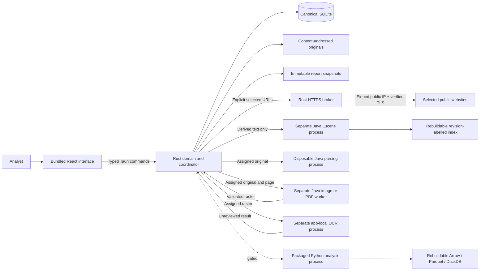

# Architecture and data ownership

Only Rust writes canonical records. Every mutation runs in an immediate SQLite transaction with an incremented workspace revision and an event record. Previous record bodies are retained in history. Analyst corrections require a reason and an expected workspace revision. A stale decision is rejected instead of overwriting newer work.

Originals are named by SHA-256. Imported display names never become filesystem paths. Existing content is deduplicated without deleting repeated transaction rows. Corrections modify canonical transaction records, preserve the original bytes, invalidate current findings and clear affected transfer matches. Snapshot HTML and its digest are retained independently of future corrections.

The current schema uses typed JSON records in a constrained SQLite table, with explicit Rust validation at mutation boundaries. SQL is fixed application code and never accepted from the interface or a recipe. Schema version 3 retains statement mappings/source dialects and adds assessment review state. Upgrades from versions 1 and 2 require a recoverable evidence-inclusive backup and transactional postcondition checks. Normalized analytical access, further migrations, pagination and high-volume snapshots remain work items.

Local Lucene indexes are disposable, contain derived text and identify their source workspace revision. The Rust supervisor validates returned IDs and revision before showing results. The native application selects the runtime from bundled resources; the UI cannot choose an executable or classpath.

Java workers receive one bounded versioned JSON request and files in a job area; OCR uses fixed arguments and assigned input/output names. Parser, search, image decoder, PDF renderer and OCR have separate process recipes. The Mac development app enables these through experimental confinement. Durable document/image/PDF jobs share a two-worker executor, reserved attempt identities, validated publication, manual retry and cancellation; unverified process termination suspends further work. Existing text and PDF/image results are immutable SQLite derivatives. The opt-in word-region engine remains separate from canonical job integration. Signed helpers and installed-platform isolation remain release gates. Running an adapter directly is an engine test, not evidence of confinement.

The UI never renders collected HTML. React escapes source text. Graph labels and map popups use text APIs. The application CSP denies remote scripts, frames, objects and external webview connections. The Rust broker is the only application HTTP path. MapLibre's worker is bundled locally and remote tile requests are refused.
