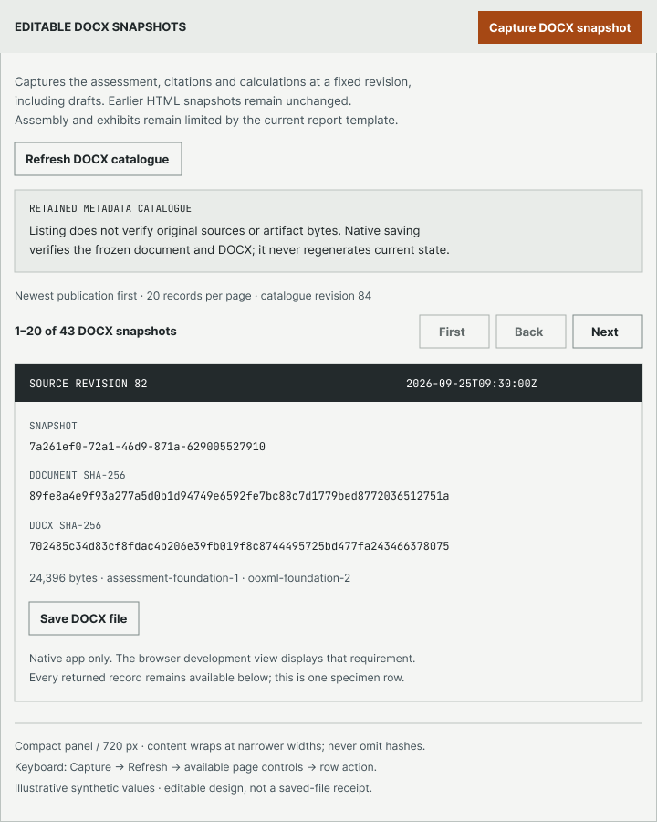
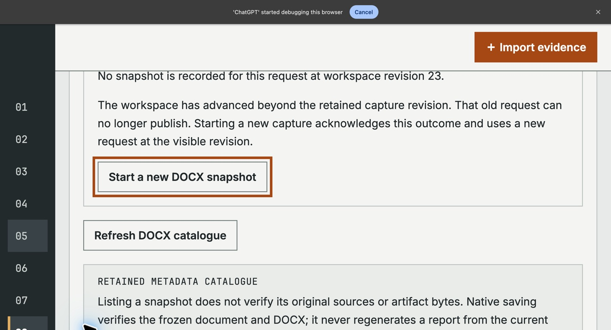

# Compact DOCX catalogue and recovery verification

On 2026-09-25, two editable compact specimens were added to the development
Figma file and compared with the current DOCX workflow at actual 200% browser
zoom. No production code, command, schema or canonical lifecycle changed.
This extends the [wide-frame comparison](DOCX-SNAPSHOTS-UI.md); it does not
establish final product approval or complete report assembly support.

## Editable design and persistence

| Frame                                                                                                                                               | Native node | Size       | Position    |
| --------------------------------------------------------------------------------------------------------------------------------------------------- | ----------- | ---------- | ----------- |
| [23 / Instrument — DOCX catalogue compact](https://www.figma.com/design/CphN4aTS8IXSVlKX7zDJtg/Entity-Workbench-development-design?node-id=2006-53) | `2006:53`   | 720 × 900  | 37500, −500 |
| [24 / Instrument — DOCX recovery compact](https://www.figma.com/design/CphN4aTS8IXSVlKX7zDJtg/Entity-Workbench-development-design?node-id=2006-104) | `2006:104`  | 720 × 1330 | 38500, −500 |

Both are top-level native frames in **Entity Workbench — development design**.
SVG input was imported into editable text/vector layers. The recovery heading
at `2006:109` was selected and its native Text/Inter/Bold/25 px properties
inspected. These are editable specimens, not screenshots pasted into Figma.
They reuse the existing industrial palette, hard-edged controls and typography;
linked component instances, auto-layout and interactive prototypes are not
claimed. The earlier wide catalogue/outcome frames remain present. No changes
to their content were intended; their complete layer trees were not diffed.

The catalogue specimen retains full digests, explicit source revision and
metadata warning before paging. One illustrative row is explicitly labelled;
it does not propose hiding any returned records. Recovery shows independent
states, not simultaneous application content. It distinguishes uncertainty,
same-revision absence and absence after the workspace advanced. Its wording
limits request retention to the open application, and explicitly excludes
reload/restart persistence.

A normal Figma reload was followed by fresh layer/property observation and new
exports of both frames. Each post-reload PNG was byte-identical to its initial
export. Both full-resolution exports were visually inspected: no overlapping
text, clipped controls or missing digest characters were observed.

[Recovery-state specimen](review/docx-compact/figma-recovery-persisted.png)
and [persisted property observation](review/docx-compact/persisted-frame-observation.txt)
retain the complementary evidence. Browser control briefly timed out after
reload; one tool-session reset restored control. The file was not duplicated
again and no account, security or sharing setting changed.

## Actual browser zoom and keyboard route

The implementation under test was clean source
`c2635c3e13fa6754b87e56d1740b91538a889c78`. A freshly built Rust `ew-dev`
served canonical operations for an isolated synthetic workspace. An ignored
Vite configuration used port 1421 and its corresponding exact host/origin
checks, leaving the tracked configuration unchanged. Google Chrome
154.0.8037.57 was driven through normal native keyboard controls. Its toolbar
explicitly reported **Zoom: 200%**. This was browser page zoom, not CSS zoom or
viewport emulation.

Read-only DOM observation at that zoom reported a 720 × 361 CSS-pixel viewport,
device-pixel ratio 4, and equal 720-pixel client/scroll widths. The panel wrapped
within the viewport; normal vertical scrolling remained necessary. The retained
screenshots are native window captures, so their pixel dimensions differ from
the CSS viewport.

| Keyboard action                                                            | Observed result                                                                  |
| -------------------------------------------------------------------------- | -------------------------------------------------------------------------------- |
| Tab through Capture, Refresh and available Next                            | Logical order; disabled First/Back skipped; visible 3 px amber focus outline     |
| Enter on Next                                                              | Final page `21–21 of 21`; focus returned to range status                         |
| Tab to First, then Back; Enter                                             | First page `1–20 of 21`; exact same row IDs and order                            |
| Reverse Tab to Capture after a separate canonical import advanced revision | Capture kept revision 22; Rust rejected publication at current revision 23       |
| Tab and Enter on Check DOCX capture outcome                                | Typed absence at revision 23; no implicit replacement                            |
| Tab to Start a new DOCX snapshot; Enter                                    | One explicitly requested new snapshot at source revision 23; current revision 24 |

The request retained through the stale capture was
`4f9b93cf-1661-4444-80ff-45d87cdea3e7`. Canonical readback confirmed all 21
earlier records remained exactly unchanged, the two visited pages covered all
21 without duplication or omission, and the final catalogue contained 22
records. The newly saved record and artifact identities are retained in the
[canonical check](review/docx-compact/canonical-check.json).

Additional captures show [Capture focus](review/docx-compact/zoom-capture-focus.png),
[last-page status focus](review/docx-compact/zoom-next-status.png), and the
[saved result](review/docx-compact/zoom-keyboard-saved.png). These four captures
were visually inspected. The active button was unobscured and text remained
readable in each observed state. While an action became disabled or its outcome
remounted, focus temporarily moved to the document; subsequent Tab retained a
usable sequential position. No keyboard trap was observed in this bounded
route. This is not a claim that every transition preserves focus on the same
element.

The [manual observations](review/docx-compact/manual-keyboard-observations.json),
[page ID readback](review/docx-compact/keyboard-pages.json),
[native zoom observation](review/docx-compact/zoom-toolbar-observation.txt), and
[source/runtime/artifact manifest](review/docx-compact/manifest.json) make the
scope and identities inspectable. The CLI build passed. No production source
changed, so no new full Rust/Clippy/browser or axe campaign is attributed to this
design-only follow-up.

## Remaining limits and cleanup

Same-revision absence, corrupt-artifact errors and native saving are represented
in the design or covered by earlier tests; they were not manually repeated in
this route. This is not a full WCAG certification, screen-reader audit, complete
keyboard audit, 400% reflow test, native WebKit test, Windows test or Word proof.
The compact recovery frame is a state reference rather than a pixel-identical
simultaneous screen. Product-owner approval and component/prototype consolidation
remain open.

Browser zoom was restored to 100%, the owned local test tab was closed, and
port 1421 was stopped and confirmed to have no listener. The editable Figma file
was retained. Word, the original view-only design and real workspaces were not
used by this task.
