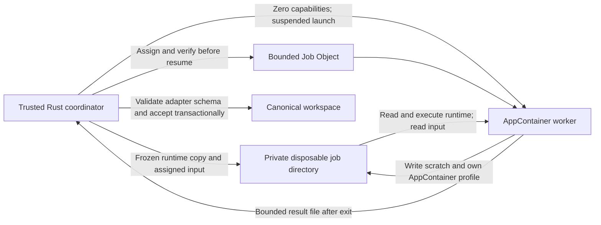

# Windows worker isolation foundation

This is an EW-03 development implementation, not an approved Windows release or a completed security acceptance. The desktop does not call this launcher yet. Native Windows evidence must be collected by the dedicated workflow and reviewed before integration. Compilation on macOS does not demonstrate Windows confinement. The hosted `windows-2022` runner is Windows Server 2022; it cannot establish Windows 11 compatibility, clean installation or the absence of developer-tool dependencies.

The implementation lives in [`crates/windows-worker`](../../crates/windows-worker). It is a separate Rust workspace crate to keep the Win32 boundary reviewable and avoid changing the working macOS engine path. Original code is Apache-2.0. Its Win32 bindings use the existing lockfile's `windows-sys` **0.61.2**, pinned exactly; serde, serde_json, thiserror, tempfile and uuid reuse existing workspace dependency versions. No additional service, interpreter, downloaded plugin or runtime-generated shell command is used by the launcher.

## Launch and data ownership



`run` accepts a trusted adapter request, a frozen runtime directory, assigned input bytes, a private scratch parent and a cancellation predicate. It copies the runtime into a disposable directory; it does not grant permissions to the caller's original runtime, evidence or workspace. Only relative executable components are accepted. Arguments use fixed path substitutions and Windows argument quoting with an explicit executable name; they are never evaluated by a shell.

Each launch creates a unique AppContainer profile with **zero capabilities**. The coordinator starts the process suspended, assigns its Job Object, checks `TokenIsAppContainer`, checks the exact package SID and checks that the capability list is empty. Only then does it resume the main thread. Every error rejects the operation; there is no retry outside AppContainer. Microsoft documents the separate package-SID access check and the capability mechanism in [Launch an AppContainer](https://learn.microsoft.com/en-us/windows/win32/secauthz/implementing-an-appcontainer).

The input and runtime use protected DACLs granting the current user and SYSTEM full control, and this launch's package SID read/execute. Scratch grants the package SID modify access and a low-integrity mandatory label. An `OWNER RIGHTS` ACE limits implicit owner permissions; input/runtime DACL-write attempts are tested separately from ordinary writes. Microsoft documents this SID in [Security identifiers](https://learn.microsoft.com/en-us/windows-server/identity/ad-ds/manage/understand-security-identifiers). No `ALL APPLICATION PACKAGES` grant is introduced. A production coordinator must also enforce protected owner/SYSTEM ACLs for **all** canonical workspace data and originals. The included `protect_private_tree` function is a disposable synthetic-test setup utility, not a workspace permission migration. AppContainer access depends on DACLs; file security is described in [File security and access rights](https://learn.microsoft.com/en-us/windows/win32/fileio/file-security-and-access-rights).

The launcher clears the inherited environment except explicit OS and scratch variables. `CreateProcessW` uses `bInheritHandles = FALSE`, no standard-handle redirection, and no console. Input and results are files, not inherited pipes. The child-process restriction and a one-process Job Object prohibit process fan-out. Cancellation terminates the assigned job and waits for the process before returning. The coordinator can pass `|| token.is_cancelled()` from `engines::CancellationToken`; the Windows crate does not define a second token type.

## Enforced and observed limits

| Resource | Implementation | Meaning |
| --- | --- | --- |
| Input | At most 16 MiB | Rejected before platform launch. |
| Runtime staging | At most 1 GiB, 10,000 entries, depth 16 | Trusted frozen runtime only; no reparse points. Copied per request. |
| Arguments | At most 64, each at most 4,096 bytes; complete command below 30,000 UTF-16 code units | Embedded NUL and traversal components rejected. |
| Process count | Job active-process limit 1 and restricted child-process policy | No children or breakaway permitted. |
| Memory | Job commitment limit between 64 MiB and 1 GiB | OS limit; not an RSS claim. |
| CPU | 30 seconds user CPU per process | OS Job Object limit. |
| Wall time | Requested positive duration up to 60 seconds, checked while running | Staging and cleanup have separate bounded-size work; filesystem latency is not a hard deadline. |
| Handles | More than 512 rejects and terminates the job | Sampled monitor, not an OS hard quota. |
| Scratch/profile files | Each at most 32 MiB of default-stream logical bytes, 512 entries, depth 16; named data streams rejected | Sampled monitor with approximately 20 ms waits; bursts can exceed the threshold before detection. |
| Result | Single ordinary file, one hardlink, at most 1 MiB | Opened without following a final reparse point, after the worker has exited. |

Job limits use [`JOBOBJECT_EXTENDED_LIMIT_INFORMATION`](https://learn.microsoft.com/en-us/windows/win32/api/winnt/ns-winnt-jobobject_extended_limit_information) and [`JOBOBJECT_BASIC_LIMIT_INFORMATION`](https://learn.microsoft.com/en-us/windows/win32/api/winnt/ns-winnt-jobobject_basic_limit_information). A failed limit setup blocks launch. The memory-overrun control requires an unsuccessful process exit rather than accepting a wall-time or launch error. It demonstrates termination under that test, not a measured peak-memory benchmark.

Live directory inspection opens each ancestor with `FILE_FLAG_OPEN_REPARSE_POINT` and without write/delete sharing, retaining the handle through recursion. A conflicting open fails the job rather than retrying without the lock. This deliberately favours a blocked job over following a worker-controlled junction or renamed directory. Share-mode and reparse semantics are documented by [`CreateFileW`](https://learn.microsoft.com/en-us/windows/win32/api/fileapi/nf-fileapi-createfilew). Native tests cover junction rejection, preserving the target during cleanup, and inability to rename a pinned directory. Non-default NTFS data streams are rejected on both files and directories using handle-based [`GetFileInformationByHandleEx`](https://learn.microsoft.com/en-us/windows/win32/api/winbase/nf-winbase-getfileinformationbyhandleex) with a fixed, aligned 64 KiB buffer; a small default stream cannot conceal a large named stream from the monitor. An unsupported stream query fails closed. Broader race stress remains required.

Cleanup is explicit: terminate/wait, remove the disposable tree without following reparse points, then delete the AppContainer profile. Directory ACL repair applies only to the stopped job's directories, using an exclusive directory handle opened with `MAXIMUM_ALLOWED`. This disables automatic child-ACE propagation as documented by [`SetSecurityInfo`](https://learn.microsoft.com/en-us/windows/win32/api/aclapi/nf-aclapi-setsecurityinfo). File ACLs and DOS attributes are not repaired; a native regression compares an outside hardlinked file's content, complete DOS attributes and DACL before and after cleanup. Safe unlinking may succeed while leaving the surviving hardlink read-only: the pinned [Rust 1.90 Windows implementation](https://github.com/rust-lang/rust/blob/1.90.0/library/std/src/sys/fs/windows.rs) can use POSIX disposition with the [ignore-read-only flag](https://learn.microsoft.com/en-us/windows-hardware/drivers/ddi/ntddk/ns-ntddk-_file_disposition_information_ex). On a filesystem that refuses deletion, the result is rejected with a cleanup error; preceding worker errors are retained. A separate deny-delete-sharing handle test requires an actual cleanup failure, preservation of the retained file, and successful cleanup after the handle closes. An unacknowledged worker exit skips all directory/profile cleanup and leaves the job for explicit recovery. Successful profile deletion is also checked for removal of its storage directory. The job-tree cleanup walk also stops at 20,000 entries or depth 64, retaining an over-budget tree for recovery. A failed cleanup is an unresolved job-recovery event, not success. Normal execution uses [`DeleteAppContainerProfile`](https://learn.microsoft.com/en-us/windows/win32/api/userenv/nf-userenv-deleteappcontainerprofile); crash recovery still needs a coordinator-owned job journal and profile reconciliation before production integration.

## Win32 safety invariants

- Owned process/thread/job/token handles have one RAII owner. The job has kill-on-close and no breakaway flag. Explicit stop/wait precedes result acceptance; Drop is a final safety net.
- SID, local-heap and COM-allocated buffers use their documented matching release functions. Profiles have distinct random names and are never reused after an already-exists error.
- Attribute buffers use pointer-aligned allocations; their borrowed values outlive process creation. An attribute list is destroyed only after successful initialization.
- UTF-16 pointers refer to live NUL-terminated buffers. OS-returned terminated strings are read only for the duration of their documented allocation. The token query buffers are sized from the OS, bounded and aligned.
- Runtime and scratch parents must be local, coordinator-owned, frozen paths. A hostile process running separately as the same interactive user is outside this boundary; it could otherwise replace trusted staging, interfere with ACL changes or kill the coordinator.
- No worker can return an authoritative database write. This launcher only returns bytes; the adapter/coordinator must validate the versioned result schema, source anchors, counts and job identity before accepting data.

## Native probe and retained evidence

[`windows-confinement.yml`](../../.github/workflows/windows-confinement.yml) builds the Rust harness with a static CRT and uses the hosted image's installed Java 21. The JDK is copied into a per-job runtime before execution. A real Java process reads its assigned input and writes its result. This tests Java VM/native-library startup and assigned file I/O; it does **not** yet test Tika, Lucene, OCR, Python or Chromium. The runner JDK is a development fixture whose file hashes and version are retained, not a selected bundled release runtime. The current runner software is documented in the [official Windows Server 2022 image manifest](https://github.com/actions/runner-images/blob/main/images/windows/Windows2022-Readme.md).

The harness first runs a deliberately unconfined control against disposable synthetic files and local TCP/HTTP/UDP listeners. It requires every attempted permission to work, including reading a deliberately inherited secret handle. The identical worker then runs through AppContainer. Expected allowed operations are assigned-input read and scratch write. Other-workspace read, original/input/runtime writes and DACL changes, caller environment, inherited handle, child processes and direct loopback TCP/HTTP/UDP must fail. UDP send/reply outcomes are separate, and the parent listener independently counts a distinct confined marker and drains queued datagrams before requiring zero reception. A spawned child or successful network connection is a violation even if it exits or the reply fails. The UDP sentinel **does not prove that all Windows DNS resolver/service routes are blocked**. No public website, real workspace, account or case data is used in these probes.

Separate modes exercise timeout, cancellation, excessive scratch bytes, excessive handles, memory exhaustion, oversized results, hardlinked results, named streams and worker-created restrictive directories. The worker-created read-only case records either successful removal with an accepted expected result and empty job directory, or a cleanup failure with no preceding worker error and retained scratch. Only the latter triggers explicit recovery of that disposable synthetic artifact; unrelated worker failures fail the probe. The expected-rejection modes must fail for the expected reason; a generic launch error cannot count as a passed test. All recoverable failure modes are followed by an empty-job-directory check. The read-only case also checks an empty job directory after successful removal or its separate recovery. Unit tests cover output hardlinks, large outputs, junctions, directory pinning, surviving read-only hardlink state, deny-delete-sharing cleanup failure, named file/directory streams and bounded overdeep cleanup. Rust unit tests that run on macOS cover argument quoting, request validation, sanitized errors and unsupported-platform blocking only.

On a Windows development machine with Rust and Java 21, the equivalent commands are:

```powershell
$env:RUSTFLAGS = '-C target-feature=+crt-static'
cargo test -p workbench-windows-worker --locked -- --test-threads=1
cargo clippy -p workbench-windows-worker --all-targets --locked -- -D warnings
cargo build -p workbench-windows-worker --bin ew-windows-probe --locked
./target/debug/ew-windows-probe.exe --report ./artifacts/windows-confinement/report.json "$env:JAVA_HOME_21_X64"
```

Development tools are test prerequisites here; end users will receive bundled dependencies. No first-run download mechanism is added.

The workflow retains source commit, run/attempt, UTC time, OS edition/version/architecture, public runner image version, runtime-relative file hashes, probe binary hash and the sanitized report even when a probe fails. It does not record machine names, user SIDs, account details, absolute profile paths or credentials. `complete_release` is always false. A missing report or failed step remains failed. Artifact retention is 30 days; any evidence used for a later release decision must be copied into the existing retained evidence process and bound to its actual candidate, policy and target.

## Remaining integration and acceptance work

1. Run the new native workflow, preserve failures and fix platform incompatibilities. Then repeat against the selected, versioned Windows 11 x64 support matrix and actual downloaded installer.
2. Integrate only reviewed adapter requests with the canonical coordinator, workspace ACL checks, durable job journal, cancellation, crash cleanup and strict result validation. Keep the current Windows engine path blocked until those checks and native confinement evidence exist.
3. Run actual Tika/PDFBox/POI and separate Lucene jobs using candidate bundled runtime bytes; extend to Python, OCR and deliberately sandboxed browser capture. Supporting subprocesses needs a separately reviewed allowance rather than weakening the one-process default.
4. Add non-loopback and resolver-path network tests, inherited-object and IPC probes, and hostile filesystem-race stress. A regular AppContainer can access OS resources granted to all application packages and its own profile/registry; it is not a total deny of the filesystem or all IPC. Assess LPAC compatibility if that narrower boundary is needed.
5. Assess stronger disk/handle containment and profile/registry growth limits. Current sampled monitors are not hard quotas; no resource-exhaustion completeness claim is made.
6. Validate full packaging, offline installation, signing, recovery and independent security review through the existing release gates. This foundation cannot close EW-03 or release readiness by itself.

## Local implementation verification — 2026-09-24

- `cargo test -p workbench-windows-worker --locked`: four macOS-hosted tests passed.
- `cargo clippy -p workbench-windows-worker --all-targets --target x86_64-pc-windows-gnu --locked -- -D warnings`: passed, including compilation of Windows-only tests and the harness. This is a compile/lint result, not execution or linking on Windows.
- Host strict Clippy, workspace formatting and `actionlint .github/workflows/windows-confinement.yml`: passed.
- Prepared native execution: ten Windows unit tests, 17 permission observations with an unconfined control, ten hostile/resource/cleanup modes and copied Java 21 assigned-I/O compatibility. Native test results are recorded separately below; the full harness and Java results remain **unverified**.

No Windows 11 hardware, signing access or independent security approval is established by these local checks.

### First native run and correction

[Development workflow run 35994614851](https://github.com/Venin-Client-Systems/entity-workbench/actions/runs/35994614851) on Windows Server 2022 reported **eight of nine unit tests passed**. The read-only hardlink regression failed at its requirement that cleanup return an error; it had returned success. That assertion ran before the outside-state checks, so the run did not establish those checks. The executable AppContainer harness and Java probe did not run.

The regression now checks outside content, full attributes and DACL regardless of the cleanup outcome, and checks that successful cleanup actually removed scratch. The read-only harness expectation likewise permits verified removal or an honest retained cleanup failure. A tenth unit test adds a deterministic kernel deny-delete-sharing obstacle. Native execution of these corrections is pending; the failed first run remains evidence and no release gate is promoted.
